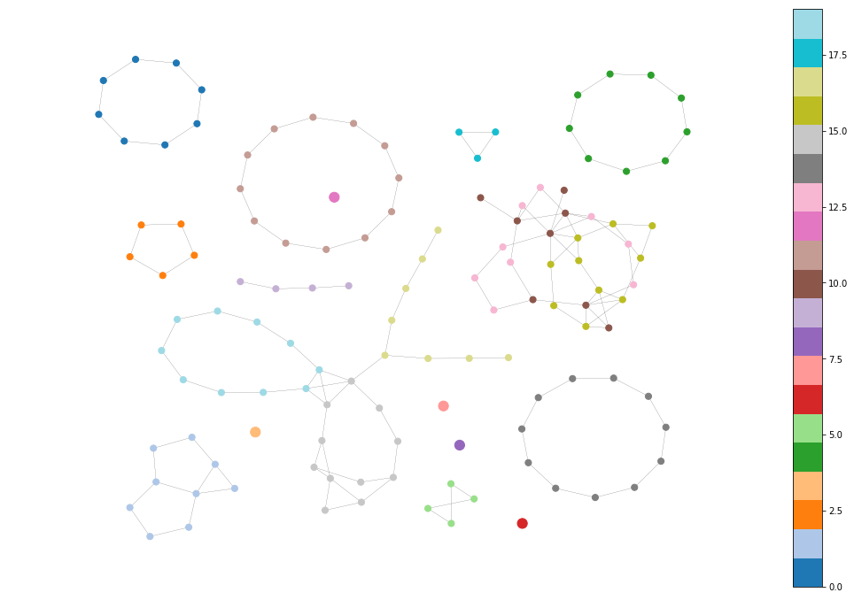
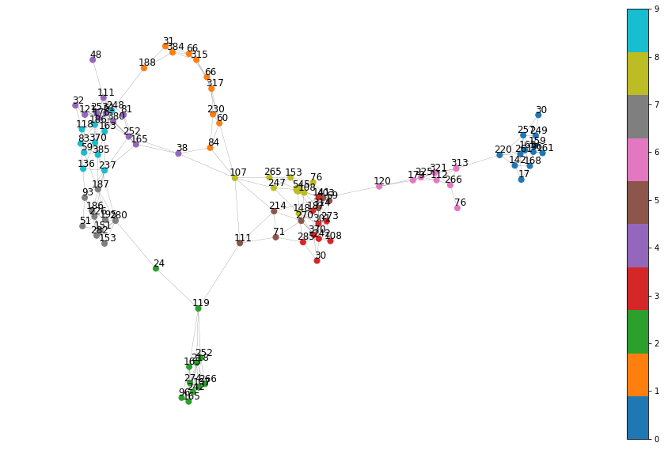

# Nerval Networks

>  I have a liking for lobsters. They are peaceful, serious creatures. They know the secrets of the sea. - Gerard de Nerval

Repo for ongoing work into directly learning a nerve complex from a dataset 
imbued with a metric using neural networks, which has nothing to do with Gerard de Nerval or lobsters apart from sharing a working name. 

The high level idea is to use an autoencoder with a a siamese auxillary loss
 and a sparse bottleneck to represent assignments to a set of overlapping 
 microclusters. The number of these microclusters can be influenced by the 
 regularization term (Louizos, Welling, and Kingma's L0 regularization). We 
 can then build a nerve complex based on overlapping assignments between 
 these microclusters to generate the Cech nerve of the metric space without
  the need for a projection step or refinement of the space through a 
  secondary clustering mechanism. 
  
This would have an advantage over existing techniques for extracting nerve complexes 
in that the sizes and shapes of these microclusters would be adaptive rather
 than bound to grids in a projection space. It would also reduce the noise 
 introduced by arbitrary grid partitions and separate clustering schemes 
 per bin. The downside would be that tuning would be less direct, since users would
 need to control hyperparameters like regularization strength and layer/neuron
 counts rather than parameters that directly tweak the space. Current obstacle is devising a scheme that 
  adjusts for data sets with different densities without heavy hyperparameter tuning.

## Examples

In the nerve complex graph, nodes represent sets of points. Edges represent the existence of an
intersection between the two sets.

*Fig 1: Learned nerve representation of COIL20 dataset. Clear cyclic patterns 
reflect the rotating objects. Rectangular objects seem to get picked up better
as radially symmetric objects tend to get collapsed to a point.*

*Fig 2: Learned nerve representation of MNIST. Using similar parameters as COIL,
MNIST doesn't break into clusters. However, the relationships between the classes
are clearly visible.*
